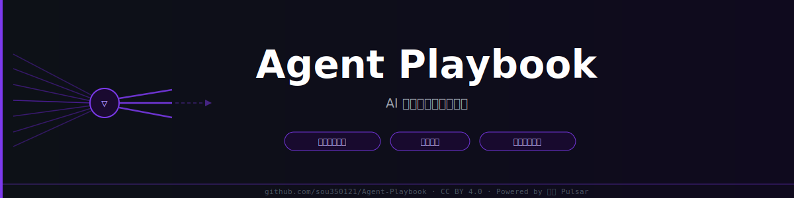

# Agent Playbook：AI 应用生态智能情报站

**每天醒来，又有 50 个新工具、100 篇解析、N 篇「AI 要革你命」的文章。**  
大多数三个月后没人记得。真正重要的信号，淹没在制造焦虑的内容里。

> AI Agent 时代，不是不需要学——而是**学错了方向代价更大**。  
> 你不需要懂 Transformer 的每一层，但你得知道 Agent 框架在什么情况下会翻车。  
> 就像开车不需要会开手动波，架构崩溃路径比算法知识点更值得花时间。

Agent Playbook 做一件事：**自动过滤焦虑，留下工程师真正用得上的。**

由 [照见 Pulsar](https://github.com/sou350121/Pulsar-KenVersion) 系统驱动，每日自动更新。

---

## 它解决的核心问题

追踪 AI 应用生态的工程师，每天面对五类问题：

1. **工具发布过载** — 每天 50+ 工具发布，其中大多数三个月内消失，没有评级机制全是噪音
2. **文档不讲生产踩坑** — 官方介绍写的是 Demo 环境，生产崩溃路径藏在 GitHub Issue 深处
3. **社区热议转瞬即逝** — Twitter 争议明天就没人提，社区共识形成过程无处归档
4. **架构评审缺工程视角** — 大多数"框架介绍"停留在 README，没有人写 AI 生成代码在哪里出错
5. **趋势预测无从验证** — "Agent 框架趋势"到处都是，没有一个说了上次预测对了几条

---

## 五个核心机制

**1. 双重过滤，只留真正有影响力的**  
RSS 自动采集后，经过 LLM 编辑评级（🔴重大 / 🟡值得关注 / 🔵背景参考）。每天 50+ 发布 → 精选 5-10 条推送。低分内容在消耗 token 之前就被丢弃。

**2. 架构深评：这个时代真正需要的知识**  
不再是"这个框架有什么功能"——而是：**它在哪里会崩溃、AI 生成的代码在哪里出错、多 Agent 并发时哪里死锁**。每篇深评固定六节：架构本质（ASCII 图）· 谁在生产用 · 崩溃场景（≥2 个）· AI 代码盲点（✅/❌ 代码对）· 并发安全雷区 · 生存代码。手动波时代的算法科普到处都有，这里只写手动波消失之后工程师需要的东西。

**3. 社交情报独立管道，不混入工具发布**  
`prep-ai-app-social.py` 单独运行，搜索词专门针对观点/争议/viral，显式过滤工具发布类内容。每日归档，一个月后还能找到当时的争论。

**4. 专家评分关卡兜底**  
所有内容经过 qwen3.5-plus 专家评分，低于阈值直接丢弃，不推送。过滤不只发生在采集端，在输出端也有一道关。

**5. 双周预测 + ✅/❌ 回顾**  
每两周的推理报告包含可验证预测，下一期必须回来打分。正确率有记录，判断力透明可查。

---

## 今日内容入口

| 内容 | 直达链接 | 更新时间（北京时间）|
|------|---------|-------------------|
| 📋 **工具日报** | [cognition/app_index.md](https://github.com/sou350121/Agent-Playbook/blob/main/cognition/app_index.md) | 每日 07:00 |
| ⭐ **编辑精选** | [ai-daily-pick/ →](https://github.com/sou350121/Agent-Playbook/tree/main/memory/blog/archives/ai-daily-pick) | 每日 07:15 |
| 🔥 **社交情报** | [ai-social-intel/ →](https://github.com/sou350121/Agent-Playbook/tree/main/memory/blog/archives/ai-social-intel) | 每日 07:45 |
| 🔍 **架构深评**（38 篇） | [cognition/frameworks/](https://github.com/sou350121/Agent-Playbook/tree/main/cognition/frameworks) | 周二 / 四 / 六 15:30 |
| 💡 **工作流灵感** | [ai-workflow-inspiration/ →](https://github.com/sou350121/Agent-Playbook/tree/main/memory/blog/archives/ai-workflow-inspiration) | 周一 / 三 / 五 / 日 15:45 |
| 📊 **双周推理报告** | [reports/biweekly/](https://github.com/sou350121/Agent-Playbook/tree/main/reports/biweekly) | 每两周 |

---

## 和这些方式相比

追踪 AI 应用生态，大多数人用的是这三种方式——先说各自真正好在哪：

**看公众号**（量子位 / 差评 / AppSo）：中文编辑团队出品，排版精良，适合订阅阅读，有不少深度评测。  
**刷小红书 AI 帖子**：真实的"我用了之后感觉怎样"——接地气，视觉化，有时候比官方文档更有用。  
**关注 X 工具推荐博主**：第一时间知道什么工具火了，社区最即时的反应和 hot take。

**选 Agent Playbook**：需要系统覆盖 + 工程深度 + 历史可查——工具好不好用，生产级别怎么判断，争议记录在哪。

| 维度 | 公众号工具推送 | 小红书 AI 帖子 | X 工具推荐博主 | **Agent Playbook** |
|------|-------------|-------------|------------|------------------|
| **最擅长** | 中文编辑精选，订阅友好 | 真实试用体验，视觉化 | 实时热议，第一反应 | 新时代工程知识：崩溃路径 + 代码盲点 + 并发安全 |
| **筛选机制** | 编辑判断（主观）| 算法推荐 | 看你关注谁 | 双重过滤：评级 + 专家评分兜底 |
| **工程深度** | ❌ 算法科普为主 | ❌ 试用体验 | ❌ 零散 | ✅ 架构崩溃路径 · AI 代码盲点 · 并发安全 |
| **历史可查** | ❌ 90 天后限流 | ❌ 被算法埋没 | ❌ 很难找 | ✅ Git 永久，全文可搜索 |
| **社区争议** | ❌ 正面倾向 | 偶尔 | ✅ 但碎片化 | ✅ 独立社交情报管道，每日归档 |
| **趋势预测验证** | ❌ | ❌ | ❌ | ✅ 双周 ✅/❌ 正确率有记录 |

---

## 智能分层架构

| 认知层 | 功能 | 实现 |
|--------|------|------|
| **感知** | 覆盖全域信号源 | RSS · 社区 web 搜索 · GitHub 发布 |
| **评级** | 噪音在推理前截断 | 🔴🟡🔵 编辑分层 |
| **推理** | 不止描述，给出判断 | 三段式 LLM：prep → agent → post |
| **专家审核** | 输出端再过一道关 | qwen3.5-plus 评分，低分不推送 |
| **社交认知** | 捕捉生态在"想什么" | 独立管道：观点 / 争议 / viral |
| **记忆沉淀** | 可查询的知识资产 | 结构化 Markdown，Git 历史 |
| **元认知** | 反思自身判断力 | 双周预测 + ✅/❌ 验证 |

---

## 由照见 Pulsar 驱动

Agent Playbook 是 [照见 Pulsar](https://github.com/sou350121/Pulsar-KenVersion) 在 AI 应用生态领域的知识输出端。Pulsar 不只是一组定时脚本——它是一个**自我进化的系统**。

**自我进化**，是指它真的会改变自己的判断：系统维护 19 条 AI 应用生态假设，每条带置信度分数。每个月，它统计哪些假设被真实数据支撑、哪些长期没有证据，然后自动调整置信度（max ±0.08/月）。长期没有支撑的假设进入 watch-list，系统下一周期主动注入更多信号去检验它。双周报告每一条预测，下一期必须回来打分（✅ 已验证 / ❌ 落空 / ⏳ 待观察）——判断力有历史记录，不靠感觉，靠数据。

在这之上：

- **自愈 Watchdog** — 15 项健康检查，RSS 中断 · LLM 超时 · 社交情报断档，故障自动恢复
- **专家评分兜底** — 每条输出经 qwen3.5-plus 评分，低于阈值直接丢弃，不推送
- **全自动** — 33 个 cron job，每天 07:00 开始，无需人工触发

这个 repo 是它每天沉淀下来、值得收藏的部分。

---

*内容：[CC BY 4.0](LICENSE)　代码：MIT*
