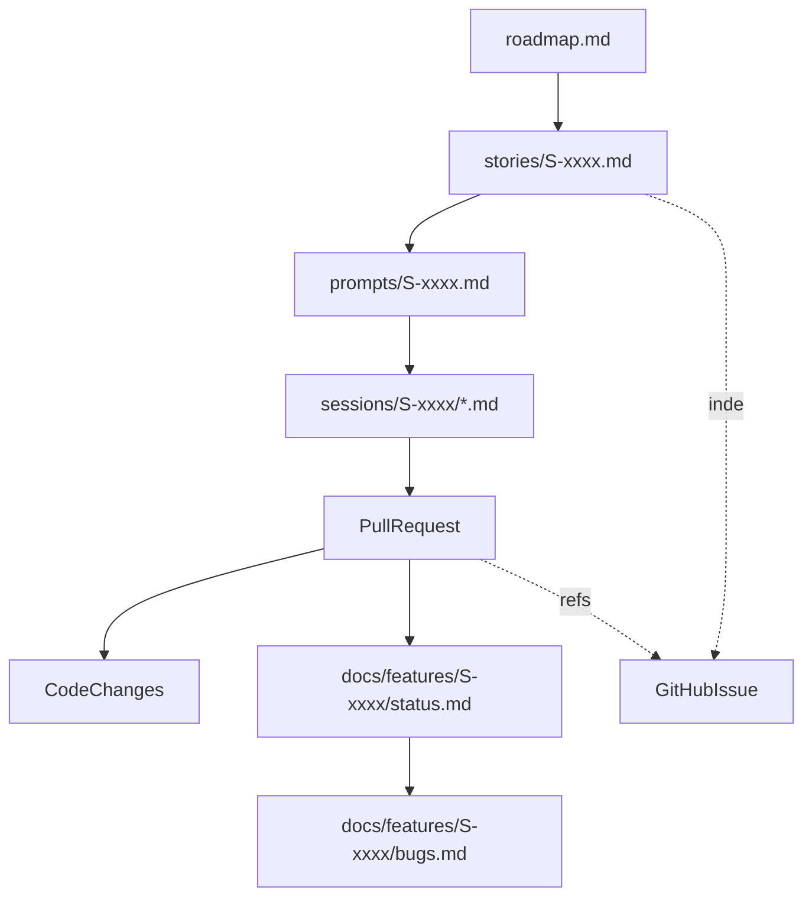

# Hybrid DocOps + AgentOps：一套可落地的 Agentic Coding 最佳实践

> 目标：把“自然语言编程”从玄学 vibes，变成可追溯、可协作、可复现的交付体系。

这篇总览把两条主线合并成一套工程方案：
- **DocOps（文档工程）**：你管理的不是源代码，而是源文档；代码是可替换的渲染结果。
- **AgentOps（代理运营）**：把 Agent 从“代码生成器”升级成“工程交付经理”，形成闭环。

关联阅读：
- `planning/agentic-coding-doc-engineering`：文档操作系统（constitution/roadmap/stories/ledger）
- `planning/a-year-of-vibes-prompt-vcs-and-agency`：Prompt VCS、PR 协作界面与责任归属

## 1. CTO 视角：为什么这套体系能扩张

- **把不确定性外包给文档系统**：需求在对话中逐步清晰，但文档是稳定锚点。
- **把可验证性作为第一约束**：每个 story 必须能写出验收标准。
- **把“生成过程证据”入库**：Prompt/会话/失败路径和代码同仓，才有真正的可复现。

## 2. Hybrid SSOT：Repo 为正文，GitHub 为索引协作层

- **Repo 正文（SSOT）**：`roadmap/stories/prompts/sessions/docs(features)`
- **GitHub 索引（协作层）**：Issues/Projects 做讨论、通知、看板；Issue 只索引不做正文。

最小规则：
- Issue **必须**包含：`stories/S-xxxx.md` canonical 链接 + TL;DR + 验收要点 + 状态/负责人。
- 代码改动在 **PR** 看 diff/review/CI。
- PR **必须** `Fixes #123`（或 `Refs #123`）并回填证据链：story +（prompt 或 failures）。

## 3. Artifact Graph：可追溯的证据链



## 4. 推荐目录结构（最小可用）

```text
AGENT_CONSTITUTION.md
roadmap.md
stories/
  S-0001-title.md
prompts/
  S-0001.md
sessions/
  S-0001/
    2025-12-23-codex.md
    failures.md
adr/
  ADR-0001-title.md
runbooks/
  rollback.md

docs/
  features/
    S-0001-title/
      status.md
      decisions.md
      bugs.md
```

## 5. AgentOps：多角色闭环 + DNA 级交付

- **角色分工闭环**：PM/架构师 → Coder → Reviewer（见 `tools/multi-agent-coding-workflow`）
- **DNA 级产出结构**：结论→分析→方案→里程碑→PR（见 `tools/agent-dna-workflow`）

## 6. 护栏（最小必需）

- **文档陈旧/失真**：模板化 + 最小校验（story 必填验收、ledger 必须存在、PR 必须回填证据链）。
- **信息只在评论里**：讨论可在 Issue/PR，但关键结论回写 `stories/` 或 `docs/features/.../decisions.md`。
- **放手派失控**：按风险分层（低风险可 vibe，中风险靠可观测+回滚，高风险必须审查+证据）。

---
> 💡 结论：让文档成为“操作系统”，让 Agent 成为“交付经理”，就能把 vibe 变成工程。
