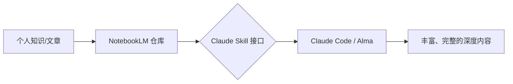

# 超级知识 Agent：NotebookLM + Claude Skill 深度实战

王树义老师的实践揭示了一个高效工作流：**将 NotebookLM 作为“知识冷库”，用 Claude Skill 作为“取货大脑”。**

## 1. 为什么不直接用 NotebookLM？

虽然 NotebookLM 的 RAG 能力极强，但它的原生交互（Chat UI）通常遵循较简单的生成逻辑。
而通过 **Claude Skill** 接入后，你可以：
- **定制输出模板**：要求结果必须包含结构化图表、代码块或深度引用。
- **跨来源合成**：让 Claude 同时对比 NotebookLM 里的私有知识和互联网上的实时数据。
- **长链推理**：利用 Claude 的思维链，在提问前先对 NotebookLM 的摘要进行多轮推演。

## 2. 核心工作流架构

## 3. 如何实现？

### 3.1 准备知识库
- 将你的 Markdown、PDF、网页链接导入 NotebookLM。
- 确保 NotebookLM 生成了高质量的内部索引。

### 3.2 编写连接 Skill
在你的 Claude Skill 定义中，通过 API 或浏览器自动化工具（如 MCP 的 Playwright 节点）获取 NotebookLM 的回答，并在指令中加入：
- “请根据 NotebookLM 提供的原始摘要，结合你自身的逻辑进行二次深度建模。”
- “输出必须包含 [特定领域模型] 的分析视角。”

### 3.3 界面联动
正如王老师提到的，在 **Alma** 或 **Claude Code** 中调用。这些工具提供了更好的 Markdown 渲染和代码块支持，让“内容丰富”不仅体现在文字上，更体现在视觉呈现上。

## 4. 启示：原生不一定是最佳

这个案例提醒我们：**不要被工具的原生 UI 限制住。** 
真正的 10x 开发者应该学会：
- 把工具当成 **API**（哪怕它没有公开 API）。
- 用最强的 Agent（如 Claude）去“殖民”那些拥有垂直数据的工具。

---

**关联阅读：**
- [Claude Skill 进阶指南：利用 skillsmp 打造全能 Agent](./claude-skills-guide.mdx)
- [Vibe Coding：意图驱动的终极形态](../planning/vibe-coding-paradigm.mdx)
