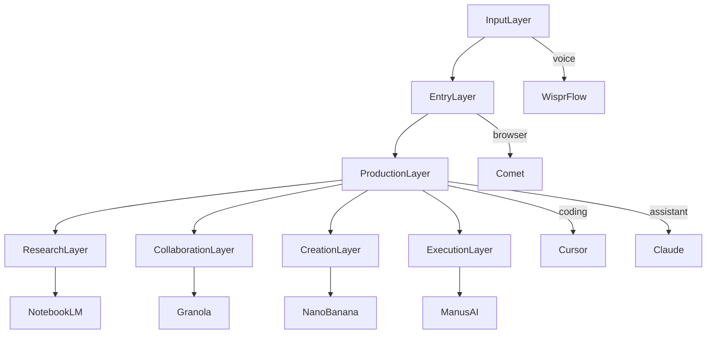

# 2025 个人 AI 工作台：从工具榜单到可复用选型框架

> 基于 Ben Lang（`@benln`）的 Top list，把“你每天真正会用的 AI 工具”组织成一套可复用的工作台架构。

## 1. 为什么这类榜单比模型榜单更重要？

模型榜单回答“谁更强”，但工具榜单回答“**我每天怎么干活**”。在 agentic coding 与知识工作里，真正的瓶颈往往不在模型参数，而在：
- 入口是否顺手
- 上下文是否容易喂进去
- 输出是否能进入你的真实工作流（代码仓库、会议、文档、浏览器）

## 2. 分层模型：把 AI 当作“工作台”而不是“App”

- **输入层**：语音转写/口述（WisprFlow）
- **入口层**：浏览器（Comet）
- **生产层**：编码（Cursor）+ 通用助手（Claude）
- **研究层**：NotebookLM
- **协作层**：会议纪要（Granola）
- **创作层**：图像（NanoBanana）
- **执行层**：通用 Agent（ManusAI）

> `Tesla FSD` 可以理解为“现实世界执行系统”的对照：它提醒我们，真正的 agent 最终会走向执行与闭环。

## 3. 选型方法：每层只选 1 个主工具

### Step 1：写下你的一天
用 10 分钟列出你的高频动作：
- 查资料、读长文、做笔记
- 写代码、改代码、review
- 开会、整理纪要、跟进任务
- 写作、输出、做图

### Step 2：映射到分层
把动作映射到“输入/入口/生产/研究/协作/创作/执行”。

### Step 3：每层只留一个主工具
原则：**宁可少而稳定，不要多而割裂。**
- 入口层固定一个（浏览器/桌面环境）
- 生产层固定一个（主力编码工具）
- 研究层固定一个（长文档/知识库）

## 4. 与本库 DocOps 的连接：把工具使用也写成可追溯文档

推荐你把“工具选择与配置”也纳入文档工程：
- 把你的工作台配置写成 `docs/tools/<tool>.mdx`
- 把关键提示词写进 `docs/_templates/prompt-vcs.mdx` 风格的 Prompt VCS
- 遇到坑就写 `failure-log`，避免未来重蹈覆辙

## 5. 参考来源
- Ben Lang：`@benln`
- Top list（原文按推文为准）：Cursor / Claude / NotebookLM / WisprFlow / Granola / Comet / NanoBanana / ManusAI / Tesla
