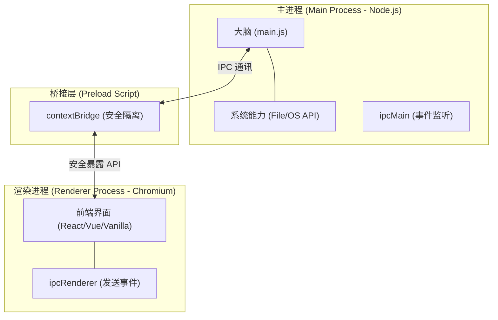

# Electron 实战全解析：从入门到进階与选型

> 本文旨在理清 Electron 领域的实务知识，涵盖核心架构、安全模型、开发工作流以及行业选型对比。

---

## 1. Electron 是什么？为什么它依然存在？

Electron 允许你使用 Web 技术（HTML/CSS/JS + 任何前端框架）开发跨平台桌面应用。它的核心是将 **Chromium（渲染 UI）** 与 **Node.js（系统能力）** 绑定在一起。

### 核心优势
- **一次编写，到处运行**：支持 Windows、macOS 和 Linux。
- **全栈能力**：既能做漂亮的 Web UI，又能通过 Node.js 调用系统 API（读写文件、网络请求、本地服务等）。

### 典型适用场景
1. **已有 Web 产品**，想快速转化为桌面版。
2. **追求 UI 一致性**，且团队主要由前端开发者构成。
3. **需要深度系统权限**：如文件系统监听、系统托盘、自定义菜单、离线数据库等。

---

## 2. 核心架构：理解“三层结构”

Electron 应用主要由三个部分组成。理解它们之间的协作逻辑，就掌握了 Electron 80% 的精髓。

### A. 主进程 (Main Process)
- **大脑**：负责创建窗口、管理应用生命周期。
- **特权**：拥有完整的 Node.js 访问权限。

### B. 渲染进程 (Renderer Process)
- **界面**：每个窗口都是一个独立的渲染进程。
- **受限**：默认无法直接调用 Node.js API，其安全性类似于普通网页。

### C. 预载脚本 (Preload Script)
- **桥梁**：在渲染进程加载前运行。
- **使命**：通过 `contextBridge` 将必要的、受限的 API 暴露给渲染进程，实现权力的最小化授予。

---

## 3. 安全模型：防范 RCE 的铁律

Electron 的风险不在于“能做很多事”，而在于**“不当授权”**。如果渲染进程（不可信的网页环境）直接获得了 Node.js 权限，一旦发生 XSS 攻击，就会演变成 RCE（远程代码执行）。

### 官方安全指南重点：
1. **开启 Context Isolation**：Electron 12+ 默认开启。它将渲染进程的 JS 环境与 Preload 脚本的环境物理隔离。
2. **启用沙盒 (Sandbox)**：渲染进程应像 Chrome 标签页一样被关在沙盒里。
3. **最小化 API 暴露**：
   - **错误做法**：直接把 `fs` 暴露给前端。
   - **正确做法**：只暴露一个 `saveFile(content)` 的 IPC 接口。

---

## 4. 开发工作流与工具链

### 推荐工具
- **[Electron Forge](https://www.electronforge.io/)**：官方推荐的一站式打包、发布工具链。
- **[electron-vite](https://electron-vite.org/)**：将 Vite 的极致开发体验带入 Electron，支持热更新（HMR）。

### 关键环节
- **本地开发**：Vite 负责前端热重载，Electron 负责外壳生命周期。
- **打包发版**：涉及代码签名 (Code Signing) 与公证 (Notarization)，尤其是 macOS 平台。
- **自动更新 (Auto-update)**：桌面端必备功能，Forge 提供了完整的集成方案。

---

## 5. 性能与体积：现实的权衡

Electron 常被吐槽“内存大户”和“安装包重”，因为它携带了完整的 Chromium。

### 优化方向
- **减负渲染进程**：避免超重的 DOM 操作和过多的背景计算。
- **重计算外移**：将 CPU 密集型任务丢给 Worker 或 Node.js 主进程。
- **现代特性**：利用懒加载、代码分割。

---

## 6. 竞品选型：什么时候不要用 Electron？

如果你对**安装包大小**和**内存占用**极度敏感，可以考虑：

- **[Tauri](https://tauri.app/)**：使用系统原生 WebView + Rust 核心。体积极小，但需注意不同系统 WebView 的兼容性差异。
- **Flutter Desktop**：UI 性能极佳，但与现有 Web 生態结合较难。
- **Qt**：传统强项，极致性能，但开发门槛高。

---

## 7. 快速学习路线

1. **Hello World**：做一个带菜单、能读写本地文件的小 Demo。
2. **精通 IPC**：通过渲染进程发送指令给主进程执行特权操作，并接收回调。
3. **默认安全**：从第一行代码开始，养成开启 `contextIsolation` 和 `sandbox` 的习惯。
4. **打包全流程**：跑通 Electron Forge 的 Packaging 与 Updating 流程。
